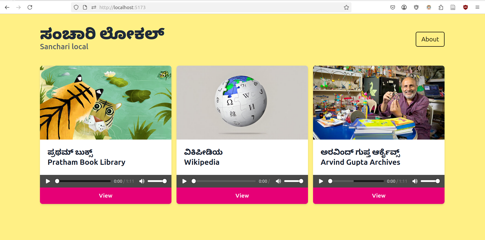
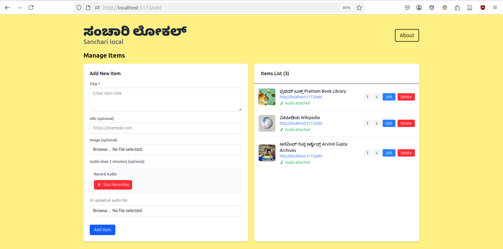

# Sanchari Homepage

This is a webapp built for the sanchari server. It has a way to easily add services with thumbnail, audio note and link to view. The add page lets you edit, delete, reorder the services. To add items go to **url/add.**





## Folder structure

1.  All metadata of with title, image path, audio path and link sits in data/items.yaml
2.  The actual audios and images are in data/audio and data/images folders
3.  Any new item added from the UI will update these data folders and files.
4.  The APIs are modular and handled in their respective subfolder/+server.js files in the src/routes/api folder
5.  The functions that call these APIs are in src/lib/utils.Js

## Editing the frontend

To make front end changes like changing titles, about page, images etc. These files are what you will have to make changes to:

1.  +layout.svelte - Edit logo, navbar and general theme
2.  about/+page.svelte - Edit everything in the About page
3.  +page.svelte - This page will not need much changes as it just has the dashboard component, but you can add more sections if needed

## Developing

Once you've cloned this project and installed dependencies with `npm install` (or `pnpm install` or `yarn`), start a development server:

``` bash
npm run dev

# or start the server and open the app in a new browser tab
npm run dev -- --open
```

## Building

To create a production version of your app:

``` bash
npm run build
```

You can preview the production build with `npm run preview`.

> To deploy your app, you may need to install an [adapter](https://svelte.dev/docs/kit/adapters) for your target environment.

## Setting up the pi home page

1.  Build repo by running `npm run build`.
2.  Write a systemctl script to start this service on whatever port needed
3.  Edit nginx configurations to serve this at port 80